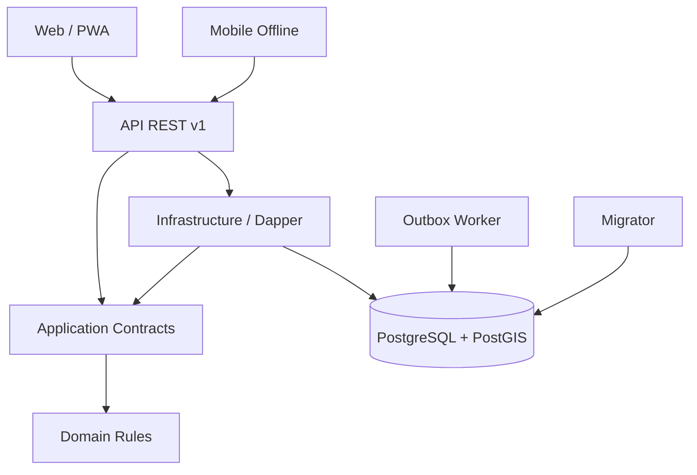
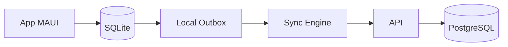

# Arquitetura do Agro 360

## Decisão principal

O produto nasce como monólito modular orientado a domínio. As fronteiras são mantidas no código, contratos e schemas do PostgreSQL; a extração para serviços distribuídos só ocorrerá quando volume, isolamento operacional ou cadência independente justificarem o custo.

## Regra de dependência

- `Domain` conhece apenas `SharedKernel`.
- `Application` conhece Domain, contratos e abstrações.
- `Infrastructure` implementa contratos de Application e conhece Dapper/Npgsql.
- Hosts compõem dependências; não contêm regra de negócio.
- Web chama a API e não acessa PostgreSQL.
- Mobile mantém Local Outbox e sincroniza pela API.

Testes de arquitetura impedem `Domain → Infrastructure`, `Domain → Web` e `Application → Hosts`.

## Módulos e schemas

| Fronteira | Schema principal | Responsabilidade |
|---|---|---|
| Platform | `platform`, `tenancy`, `identity`, `organization` | tenant, acesso, módulos, Outbox |
| Properties | `geo` | propriedades, talhões e gêmeo digital |
| Agriculture | `agriculture`, `agronomy`, `precision_agriculture` | safra, planejamento e operações |
| Livestock | `livestock`, `pasture`, `dairy` | animal, lote, sanidade e desempenho |
| Inventory | `inventory`, `warehouse` | produtos, depósitos, saldos e lotes |
| Fleet | `fleet` | ativos, telemetria, manutenção e combustível |
| Finance | `finance`, `cost` | recebíveis e motor universal de custos |
| Commercial | `commercial`, `purchasing` | compra, venda e contratos |
| Logistics | `logistics` | carga e torre de controle |
| Traceability | `traceability` | AgroGraph e cadeia de custódia |
| Documents | `documents` | metadados GED e armazenamento externo |
| Sustainability | `environment` | compliance, ESG e carbono |
| People | `hr` | RH rural e segurança do trabalho |
| Automation | `workflow`, `notification` | workflow, regras e alertas |
| Intelligence | `analytics`, `ai`, `iot`, `integration` | BI, IA, IoT e adapters |
| Audit | `audit` | trilha imutável de ações |

## Multi-tenancy

Hierarquia: Tenant → Grupo Econômico → Empresa/Unidade → Fazenda → Área Operacional.

Defesa em profundidade:

1. `tenant_id` obrigatório em toda tabela operacional;
2. contexto construído exclusivamente a partir da claim JWT;
3. todas as transações executam `set_config('app.tenant_id', ..., true)`;
4. Row-Level Security habilitado e forçado;
5. chaves estrangeiras compostas evitam vínculos entre tenants;
6. auditoria registra tenant e usuário;
7. teste de integração verifica cobertura RLS.

Em produção o usuário da aplicação deve ser não-superusuário. O usuário de migração deve ser separado e não deve ser reutilizado pela API.

## Persistência e transação

- Dapper é usado explicitamente nas fronteiras de infraestrutura.
- `DatabaseExecutor` abre conexão e transação, configura tenant, traduz erros PostgreSQL e garante rollback.
- Operações críticas escrevem domínio, estoque, custo, financeiro, auditoria e Outbox antes do `COMMIT`.
- Eventos externos só saem pelo Outbox Worker após o commit.
- `numeric(18,4)` ou precisão superior é usado para dinheiro e medidas; `double` não é aceito.
- entidades críticas usam `version` e atualização condicional.
- exclusão operacional usa `deleted_at`; eventos históricos são cancelados/estornados.

## Identificadores

- UUIDv7 é criado na aplicação para ordenação temporal e operação offline.
- `code bigint identity` serve apenas como código humano.
- códigos de negócio nunca são chave primária.

## Tratamento de erros

Não existe `try/catch` vazio. O tratamento global converte erros em Problem Details. `try/catch` explícito fica nas fronteiras de banco, worker, arquivos, integrações e sincronização.

| Exceção | HTTP | Código |
|---|---:|---|
| `ValidationException` | 422 | `validation_error` |
| `NotFoundException` | 404 | `resource_not_found` |
| `ConflictException` | 409 | `business_conflict` |
| `ForbiddenException` | 403 | `forbidden` |
| `DomainException` | 422 | `business_rule` |
| falha desconhecida | 500 | `internal_error` |

## Offline-first

Financeiro, estoque, sanidade e permissões sempre exigem revisão humana quando existe conflito de versão. Eventos anexáveis podem usar merge automático; cadastros não críticos usam servidor prioritário por padrão.

## Observabilidade

- Serilog estruturado em todos os hosts;
- correlation ID aceito/gerado em `X-Correlation-ID`;
- health checks de processo e PostgreSQL;
- campos mínimos: tenant, usuário, módulo, ação, entidade, request e duração;
- OpenTelemetry, métricas Prometheus e storage S3 entram na sprint de hardening sem alterar contratos de domínio.

## Definition of Done

Uma funcionalidade só fecha quando Domain, Application, Infrastructure, migração, API, UI, permissão, validação, auditoria, logging, exceções e testes estão conectados. Tabela ou tela isolada não significa módulo concluído.
